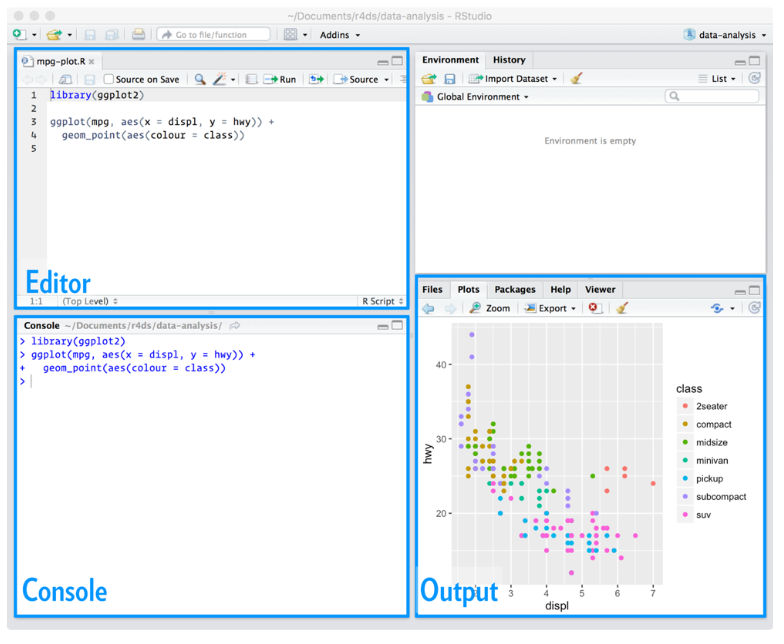
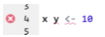
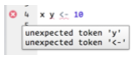
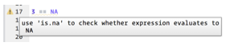

Para tener más espacio para trabajar, es una buena idea utilizar el editor de scripts. Para abrirlo, podemos clickear **File > New File > Rscript** o utilizando el shorcut `Cmd/Ctrl-Shift-N`
 
 
 
 El editor de scripts es un buen lugar para poner el código que nos importa. Podemos experimentar en la consola, pero una vez que escribimos código que funciona y hace lo que queremos, hay que ponerlo en el editor de script. 
 
 
 ## Running code
 
 El editor de scripts es un buen lugar para construir gráficas complejas hechas con **gplot2** o secuencias largas de manipulaciones con **dplyr**. La clave para utiliza eficientemente el editor de script es memorizando uno de los shortcuts más importantes `Cmd/Ctrl-Enter` (ejecuta en la consola la expresión en la que estemos parados.
 
 
 ```
library(dplyr)
library(nycflights13)

not_cancelled <- flights %>%
filter(!is.na(dep_delay), !is.na(arr_delay))

not_cancelled %>%
group_by(year, month, day) %>%
summarize(mean = mean(dep_delay))
 ```
 
En vez de correr expresión por expresión, podemos correr el script completo en un paso: `Cmd/Ctrl-Shift-S`.

El autor recomienda siempre empezar los scripts con las paqueterías que necesitamos. **Ojo: nunca incluir `install.packages()` o `setwd()` en un script que compartimos**. "It’s very antisocial to change settings on someone else’s computer!"

## RStudio Diagnostics

El editor de scripts también nos va a señalar los errores de sintáxis con un subrayado y una cruz en la barra lateral. 




Si presionamos sobre la cruz, podemos ver cuál es el problema:



RStudio también nos permite saber sobre los potenciales problemas:




## Ejercicios

1. Ve al twitter [@rstudiotips](https://twitter.com/rstudiotips) y encuentra un tip que se vea interesante.
2. ¿Qué otros errores comunes reporta el diagnóstico de RStudio?

<details>
<summary>**Respuesta**</summary>
<br>

**Trata de detectar si una función va a funcionar cuando la llamamos, por lo que reporta:**

* Argumentos faltantes
* Argumentos que no concuerdan
* Argumentos que concuerdan parcialmente
* Exceso de argumentos


**Avisa si una variable no está definida**
**Avisa si una variable está definida, pero no está siendo utilizada**
**Provee diagnósticos de estilo (por ejemplo, espacios en blanco)**
</details>
 